# LL-Verifier

## Roadmap
- Source code: `src/`
- Benchmark: `benchmark/`
- Prompt for generating Maude directly in ablation evaluation: in `src/prompts_text.py`
- Attack traces in Section 5: `output/trace`
- Vendor response: `Vendor-Response/`
- PoC videos: `PoC-Videos/`

## Source Code

### Prerequisites
+ Python3.8+
+ maude v3.2.2+
+ set environment variable $EDITOR
+ `cp lib/preludePatched.maude /usr/share/maude/prelude.maude`
+ `cp configs/config.yaml.sample configs/config.yaml` , then edit configs/config.yaml
+ `bash scripts/bootstrap.sh`
+ `source venv/bin/activate`

### Usage

#### Generation
`python src/main.py <path_to_protocol_text>`

#### Checking:
`maude output/XXX/checker.maude`

## Vendor Response
- Philips Hue RTE
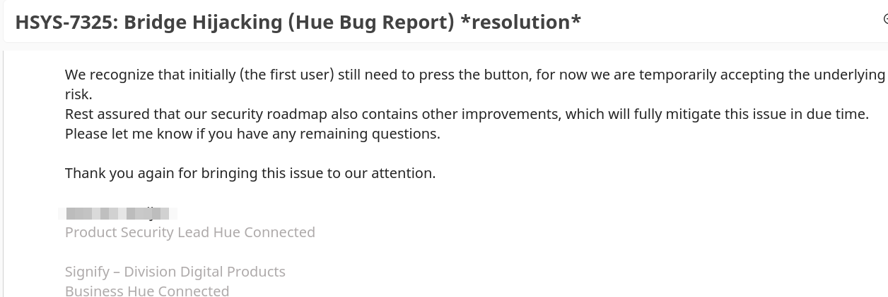
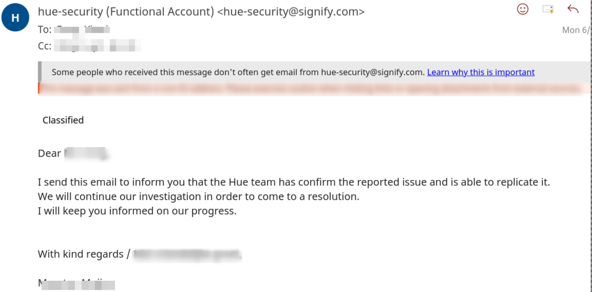
- Broadlink RTE
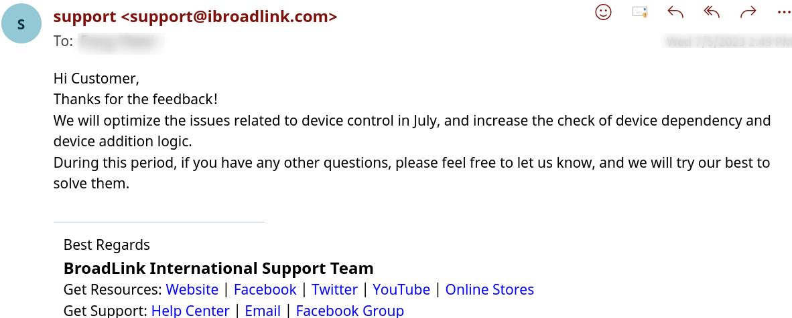
- Imou RTE
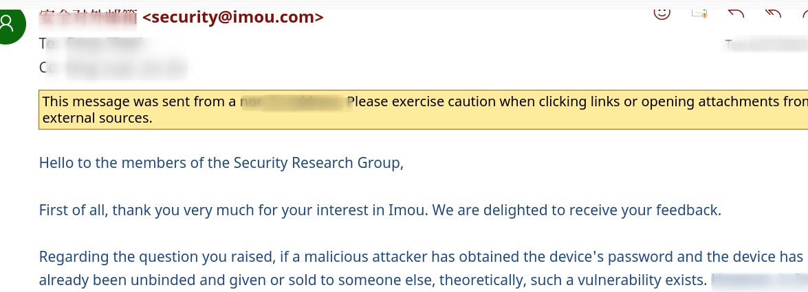
- Aqara (Flaw 8)
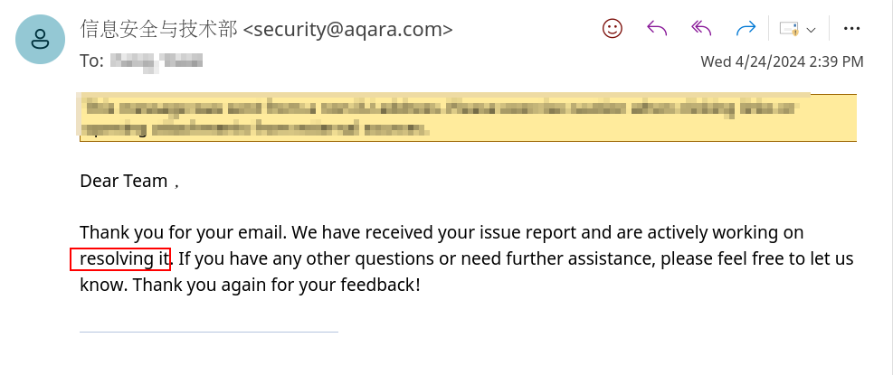
- Tuya (Flaw 9)
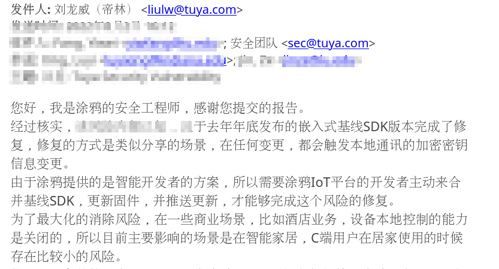
- Beurer RTE
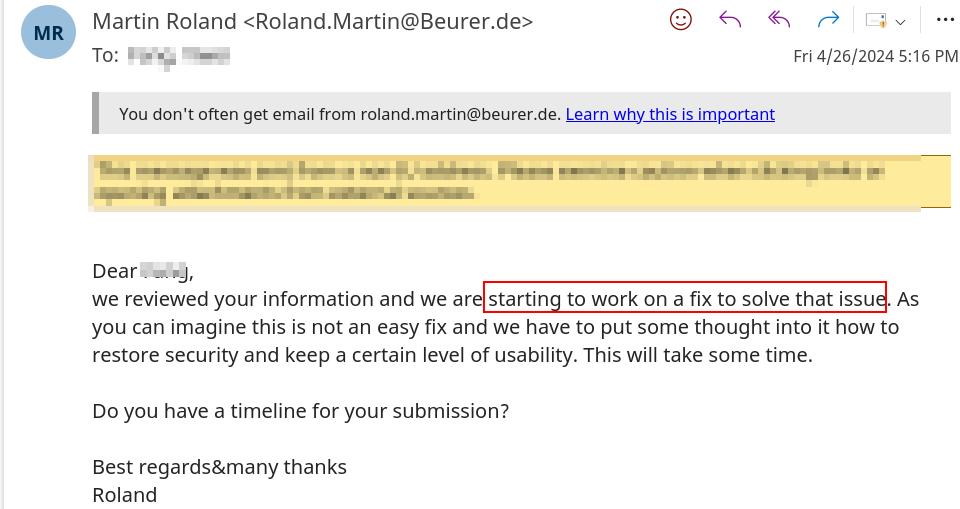
- Govee RTE
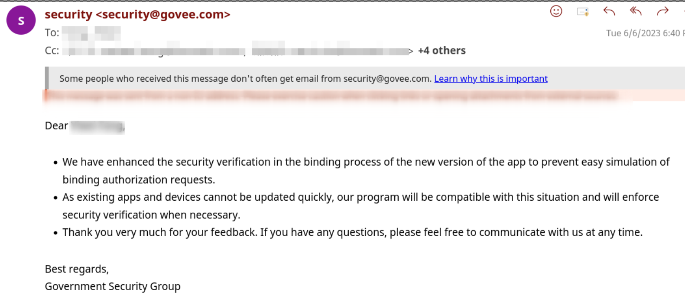
- Meross RTE

- Oray RTE
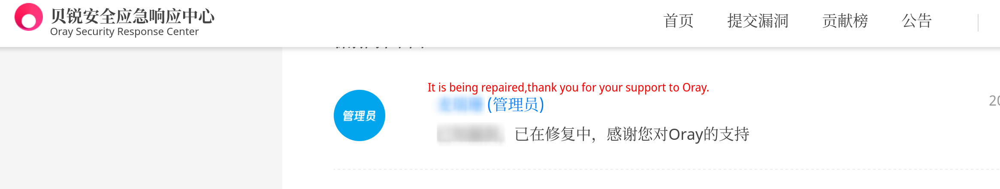
- Switchbot RTE
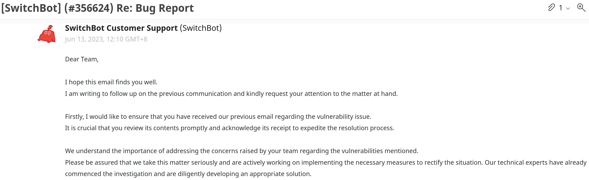
- Wiz RTE
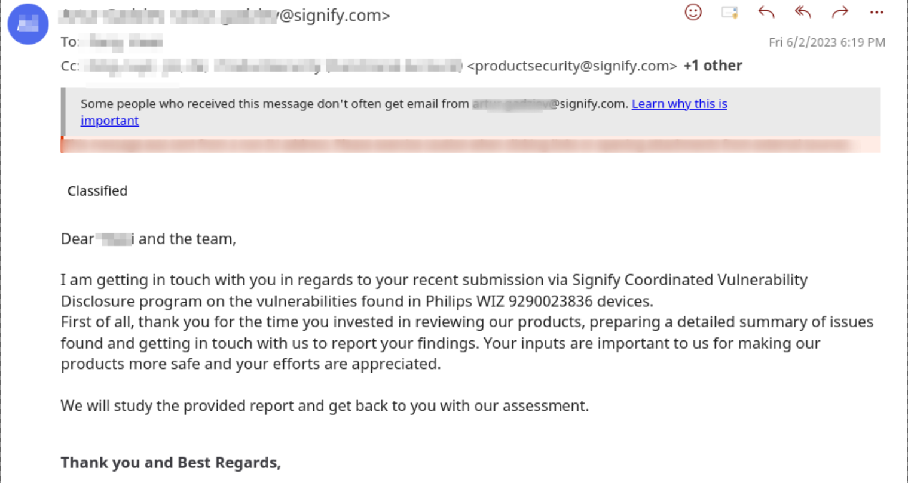
- Xiaomi CAC
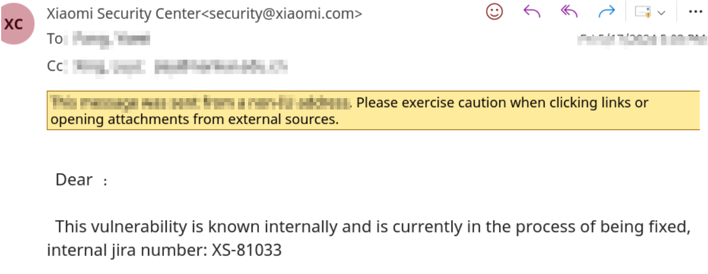
