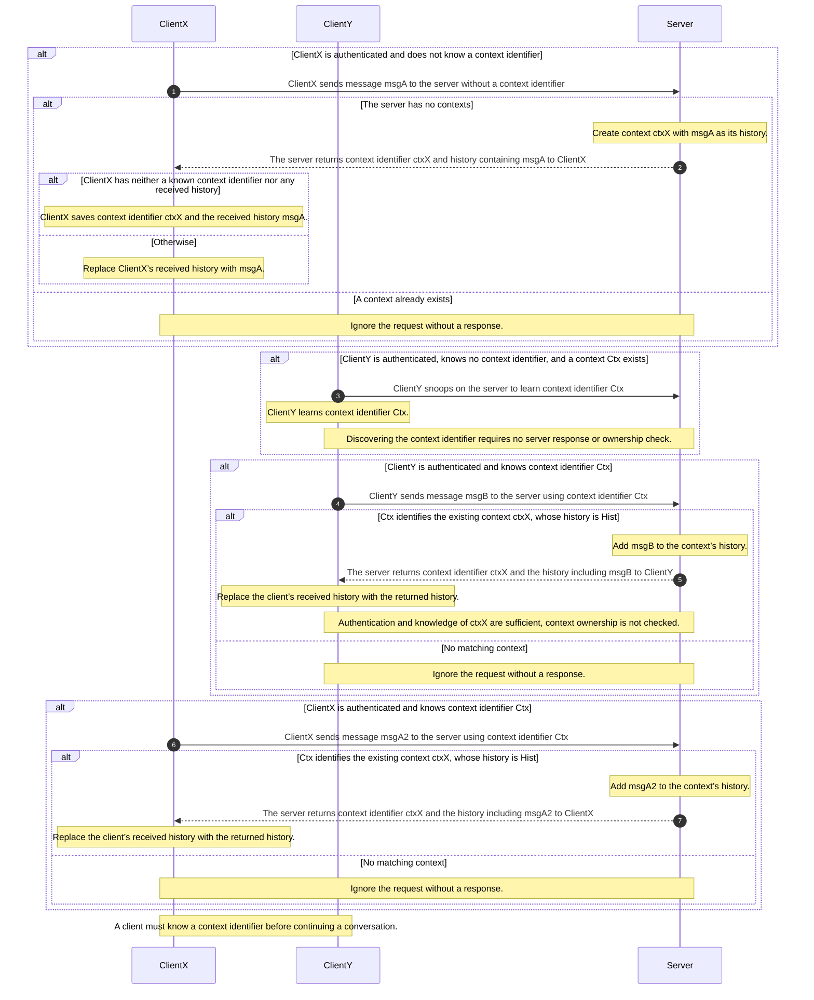

```mermaid
sequenceDiagram
    autonumber
    participant ClientX
    participant ClientY
    participant Server


    alt ClientX is authenticated and does not know a context identifier
        ClientX->>Server: ClientX sends message msgA to the server without a context identifier
        alt The server has no contexts
            Note over Server: Create context ctxX with msgA as its history.
            Server-->>ClientX: The server returns context identifier ctxX and history containing msgA to ClientX
            alt ClientX has neither a known context identifier nor any received history
                Note over ClientX: ClientX saves context identifier ctxX and the received history msgA.
            else Otherwise
                Note over ClientX: Replace ClientX’s received history with msgA.
            end
        else A context already exists
            Note over ClientX,Server: Ignore the request without a response.
        end
    end

    alt ClientY is authenticated, knows no context identifier, and a context Ctx exists
        ClientY->>Server: ClientY snoops on the server to learn context identifier Ctx
        Note over ClientY: ClientY learns context identifier Ctx.
        Note over ClientY,Server: Discovering the context identifier requires no server response or ownership check.
    end

    alt ClientY is authenticated and knows context identifier Ctx
        ClientY->>Server: ClientY sends message msgB to the server using context identifier Ctx
        alt Ctx identifies the existing context ctxX, whose history is Hist
            Note over Server: Add msgB to the context’s history.
            Server-->>ClientY: The server returns context identifier ctxX and the history including msgB to ClientY
            Note over ClientY: Replace the client’s received history with the returned history.
            Note over ClientY,Server: Authentication and knowledge of ctxX are sufficient, context ownership is not checked.
        else No matching context
            Note over ClientY,Server: Ignore the request without a response.
        end
    end

    alt ClientX is authenticated and knows context identifier Ctx
        ClientX->>Server: ClientX sends message msgA2 to the server using context identifier Ctx
        alt Ctx identifies the existing context ctxX, whose history is Hist
            Note over Server: Add msgA2 to the context’s history.
            Server-->>ClientX: The server returns context identifier ctxX and the history including msgA2 to ClientX
            Note over ClientX: Replace the client’s received history with the returned history.
        else No matching context
            Note over ClientX,Server: Ignore the request without a response.
        end
    end

    Note over ClientX,ClientY: A client must know a context identifier before continuing a conversation.
```
