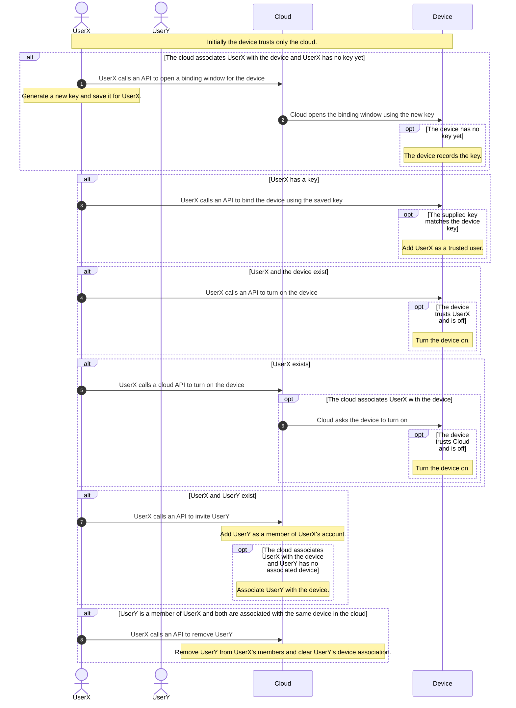

```mermaid
sequenceDiagram
    autonumber
    actor UserX
    actor UserY
    participant Cloud
    participant Device
    Note over UserX,Device: Initially the device trusts only the cloud.

    %% Action 1: openWindow
    alt The cloud associates UserX with the device and UserX has no key yet
        UserX->>Cloud: UserX calls an API to open a binding window for the device
        Note over UserX: Generate a new key and save it for UserX.
        Cloud->>Device: Cloud opens the binding window using the new key
        opt The device has no key yet
            Note over Device: The device records the key.
        end
    end

    %% Action 2: bind
    alt UserX has a key
        UserX->>Device: UserX calls an API to bind the device using the saved key
        opt The supplied key matches the device key
            Note over Device: Add UserX as a trusted user.
        end
    end

    %% Action 3: direct control
    alt UserX and the device exist
        UserX->>Device: UserX calls an API to turn on the device
        opt The device trusts UserX and is off
            Note over Device: Turn the device on.
        end
    end

    %% Action 4: control through the cloud
    alt UserX exists
        UserX->>Cloud: UserX calls a cloud API to turn on the device
        opt The cloud associates UserX with the device
            Cloud->>Device: Cloud asks the device to turn on
            opt The device trusts Cloud and is off
                Note over Device: Turn the device on.
            end
        end
    end

    %% Action 5: invite
    alt UserX and UserY exist
        UserX->>Cloud: UserX calls an API to invite UserY
        Note over Cloud: Add UserY as a member of UserX's account.
        opt The cloud associates UserX with the device and UserY has no associated device
            Note over Cloud: Associate UserY with the device.
        end
    end

    %% Action 6: kick member
    alt UserY is a member of UserX and both are associated with the same device in the cloud
        UserX->>Cloud: UserX calls an API to remove UserY
        Note over Cloud: Remove UserY from UserX's members and clear UserY's device association.
    end
```
