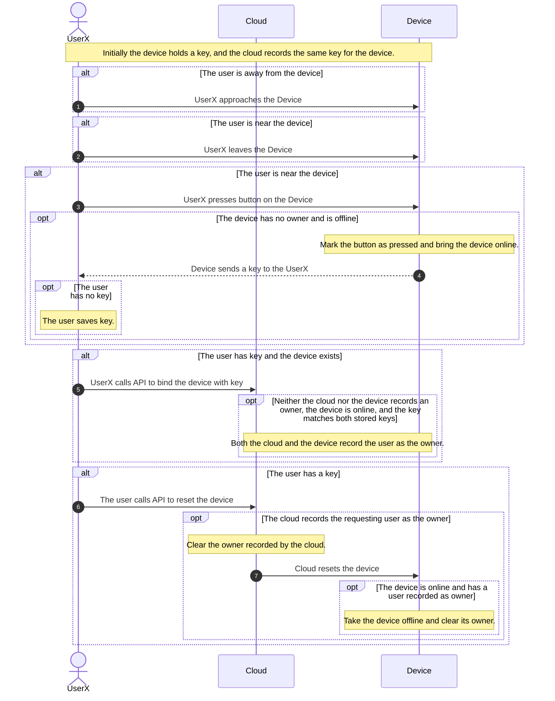

```mermaid
sequenceDiagram
    autonumber
    actor UserX
    participant Cloud
    participant Device
    Note over UserX,Device: Initially the device holds a key, and the cloud records the same key for the device.

    %% Action 1: approaches
    alt The user is away from the device
        UserX->>Device: UserX approaches the Device
    end

    %% Action 2: leaves
    alt The user is near the device
        UserX->>Device: UserX leaves the Device
    end

    %% Action 3: press button
    alt The user is near the device
        UserX->>Device: UserX presses button on the Device

        opt The device has no owner and is offline
            Note over Device: Mark the button as pressed and bring the device online.
            Device-->>UserX: Device sends a key to the UserX

            opt The user has no key
                Note over UserX: The user saves key.
            end

        end
    end

    %% Action 4: callAPI:bind
    alt The user has key and the device exists
        UserX->>Cloud: UserX calls API to bind the device with key
        opt Neither the cloud nor the device records an owner, the device is online, and the key matches both stored keys
            Note over Cloud,Device: Both the cloud and the device record the user as the owner.
        end
    end

    %% Action 5: callAPI:reset
    alt The user has a key
        UserX->>Cloud: The user calls API to reset the device 
        opt The cloud records the requesting user as the owner
            Note over Cloud: Clear the owner recorded by the cloud.
            Cloud->>Device: Cloud resets the device
            opt The device is online and has a user recorded as owner
                Note over Device: Take the device offline and clear its owner.
            end
        end
    end
```
