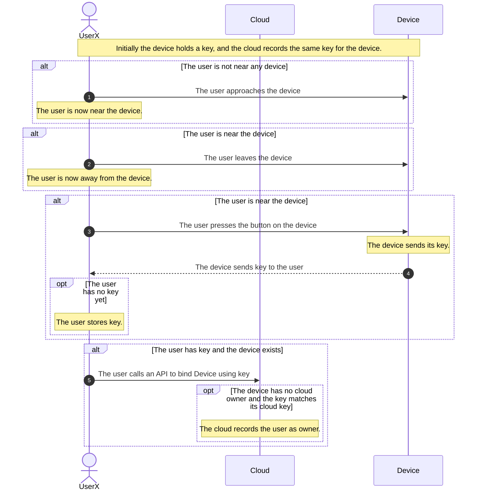

```mermaid
sequenceDiagram
    autonumber
    actor UserX
    participant Cloud
    participant Device
    Note over UserX,Device: Initially the device holds a key, and the cloud records the same key for the device.
    alt The user is not near any device
        UserX->>Device: The user approaches the device
        Note over UserX: The user is now near the device.
    end
    alt The user is near the device
        UserX->>Device: The user leaves the device
        Note over UserX: The user is now away from the device.
    end
    alt The user is near the device
        UserX->>Device: The user presses the button on the device
        Note over Device: The device sends its key.
        Device-->>UserX: The device sends key to the user
        opt The user has no key yet
            Note over UserX: The user stores key.
        end
    end
    alt The user has key and the device exists
        UserX->>Cloud: The user calls an API to bind Device using key
        opt The device has no cloud owner and the key matches its cloud key
            Note over Cloud: The cloud records the user as owner.
        end
    end
```
