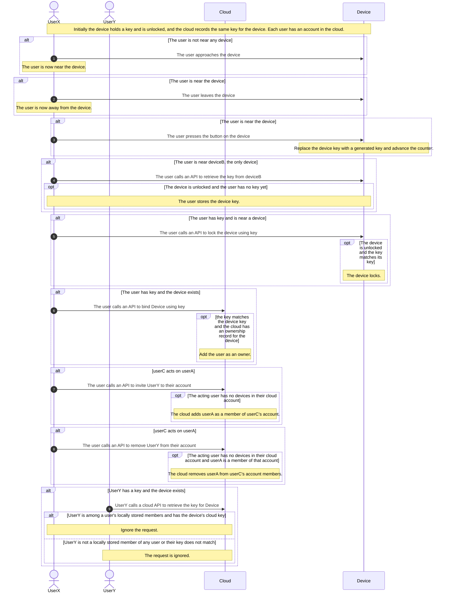

```mermaid
sequenceDiagram
    autonumber
    actor UserX
    actor UserY
    participant Cloud
    participant Device
    Note over UserX,Device: Initially the device holds a key and is unlocked, and the cloud records the same key for the device. Each user has an account in the cloud.
    alt The user is not near any device
        UserX->>Device: The user approaches the device
        Note over UserX: The user is now near the device.
    end
    alt The user is near the device
        UserX->>Device: The user leaves the device
        Note over UserX: The user is now away from the device.
    end
    alt The user is near the device
        UserX->>Device: The user presses the button on the device
        Note over Device: Replace the device key with a generated key and advance the counter.
    end
    alt The user is near deviceB, the only device
        UserX->>Device: The user calls an API to retrieve the key from deviceB
        opt The device is unlocked and the user has no key yet
            Note over UserX,Device: The user stores the device key.
        end
    end
    alt The user has key and is near a device
        UserX->>Device: The user calls an API to lock the device using key
        opt The device is unlocked and the key matches its key
            Note over Device: The device locks.
        end
    end
    alt The user has key and the device exists
        UserX->>Cloud: The user calls an API to bind Device using key
        opt the key matches the device key and the cloud has an ownership record for the device
            Note over Cloud: Add the user as an owner.
        end
    end
    alt userC acts on userA
        UserX->>Cloud: The user calls an API to invite UserY to their account
        opt The acting user has no devices in their cloud account
            Note over Cloud: The cloud adds userA as a member of userC's account.
        end
    end
    alt userC acts on userA
        UserX->>Cloud: The user calls an API to remove UserY from their account
        opt The acting user has no devices in their cloud account and userA is a member of that account
            Note over Cloud: The cloud removes userA from userC's account members.
        end
    end
    alt UserY has a key and the device exists
        UserY->>Cloud: UserY calls a cloud API to retrieve the key for Device
        alt UserY is among a user's locally stored members and has the device's cloud key
            Note over UserX,Cloud: Ignore the request.
        else UserY is not a locally stored member of any user or their key does not match
            Note over UserY,Cloud: The request is ignored.
        end
    end
```
