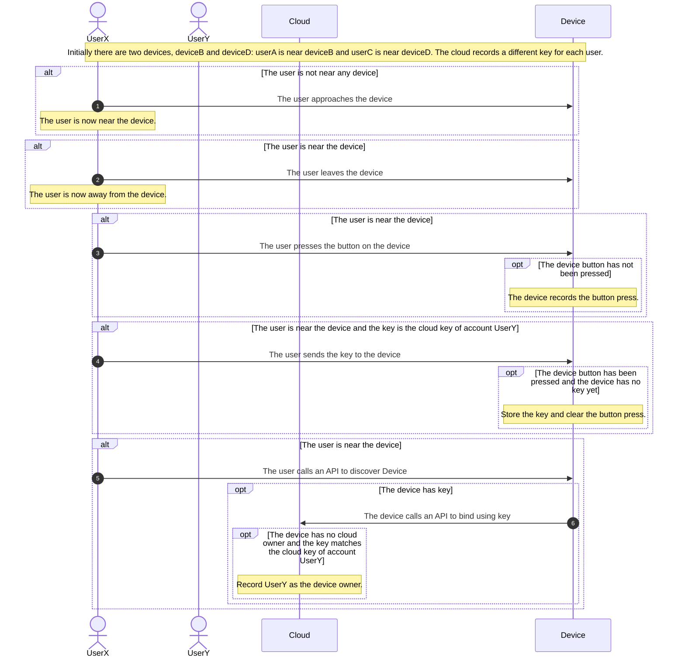

```mermaid
sequenceDiagram
    autonumber
    actor UserX
    actor UserY
    participant Cloud
    participant Device
    Note over UserX,Device: Initially there are two devices, deviceB and deviceD: userA is near deviceB and userC is near deviceD. The cloud records a different key for each user.
    alt The user is not near any device
        UserX->>Device: The user approaches the device
        Note over UserX: The user is now near the device.
    end
    alt The user is near the device
        UserX->>Device: The user leaves the device
        Note over UserX: The user is now away from the device.
    end
    alt The user is near the device
        UserX->>Device: The user presses the button on the device
        opt The device button has not been pressed
            Note over Device: The device records the button press.
        end
    end
    alt The user is near the device and the key is the cloud key of account UserY
        UserX->>Device: The user sends the key to the device
        opt The device button has been pressed and the device has no key yet
            Note over Device: Store the key and clear the button press.
        end
    end
    alt The user is near the device
        UserX->>Device: The user calls an API to discover Device
        opt The device has key
            Device->>Cloud: The device calls an API to bind using key
            opt The device has no cloud owner and the key matches the cloud key of account UserY
                Note over Cloud: Record UserY as the device owner.
            end
        end
    end
```
