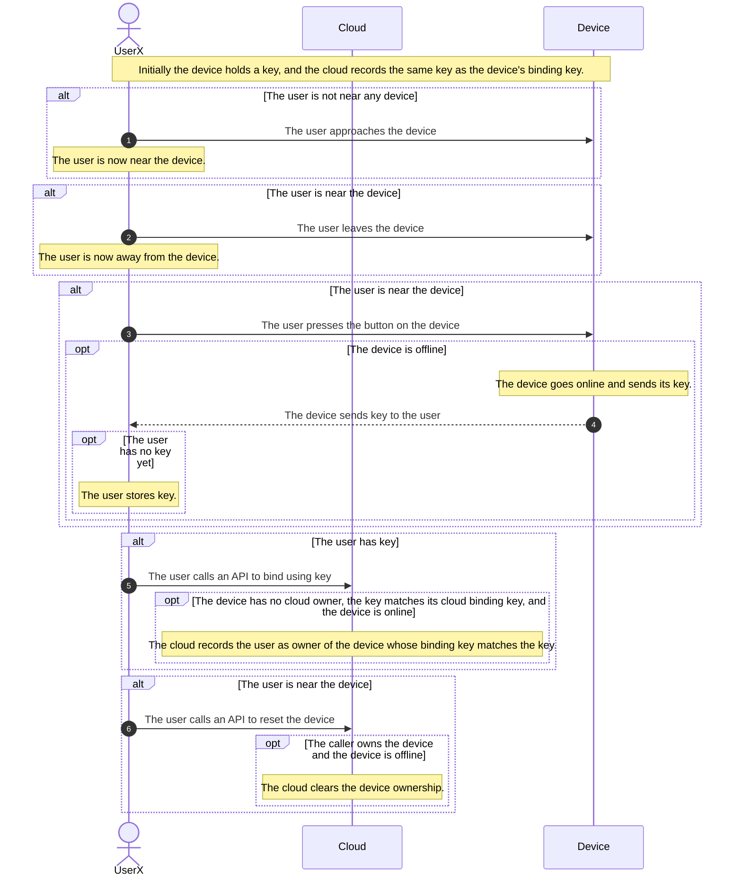

```mermaid
sequenceDiagram
    autonumber
    actor UserX
    participant Cloud
    participant Device
    Note over UserX,Device: Initially the device holds a key, and the cloud records the same key as the device's binding key.
    alt The user is not near any device
        UserX->>Device: The user approaches the device
        Note over UserX: The user is now near the device.
    end
    alt The user is near the device
        UserX->>Device: The user leaves the device
        Note over UserX: The user is now away from the device.
    end
    alt The user is near the device
        UserX->>Device: The user presses the button on the device
        opt The device is offline
            Note over Device: The device goes online and sends its key.
            Device-->>UserX: The device sends key to the user
            opt The user has no key yet
                Note over UserX: The user stores key.
            end
        end
    end
    alt The user has key
        UserX->>Cloud: The user calls an API to bind using key
        opt The device has no cloud owner, the key matches its cloud binding key, and the device is online
            Note over Cloud: The cloud records the user as owner of the device whose binding key matches the key.
        end
    end
    alt The user is near the device
        UserX->>Cloud: The user calls an API to reset the device
        opt The caller owns the device and the device is offline
            Note over Cloud: The cloud clears the device ownership.
        end
    end
```
