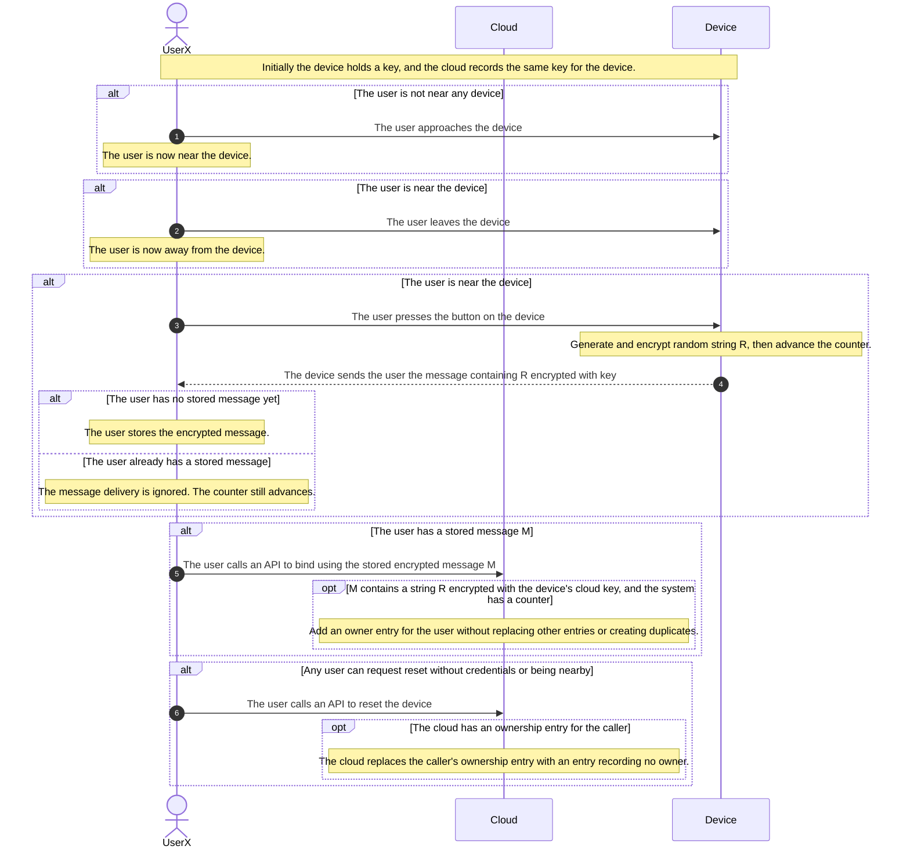

```mermaid
sequenceDiagram
    autonumber
    actor UserX
    participant Cloud
    participant Device
    Note over UserX,Device: Initially the device holds a key, and the cloud records the same key for the device.
    alt The user is not near any device
        UserX->>Device: The user approaches the device
        Note over UserX: The user is now near the device.
    end
    alt The user is near the device
        UserX->>Device: The user leaves the device
        Note over UserX: The user is now away from the device.
    end
    alt The user is near the device
        UserX->>Device: The user presses the button on the device
        Note over Device: Generate and encrypt random string R, then advance the counter.
        Device-->>UserX: The device sends the user the message containing R encrypted with key
        alt The user has no stored message yet
            Note over UserX: The user stores the encrypted message.
        else The user already has a stored message
            Note over UserX: The message delivery is ignored. The counter still advances.
        end
    end
    alt The user has a stored message M
        UserX->>Cloud: The user calls an API to bind using the stored encrypted message M
        opt M contains a string R encrypted with the device's cloud key, and the system has a counter
            Note over Cloud: Add an owner entry for the user without replacing other entries or creating duplicates.
        end
    end
    alt Any user can request reset without credentials or being nearby
        UserX->>Cloud: The user calls an API to reset the device
        opt The cloud has an ownership entry for the caller
            Note over Cloud: The cloud replaces the caller's ownership entry with an entry recording no owner.
        end
    end
```
