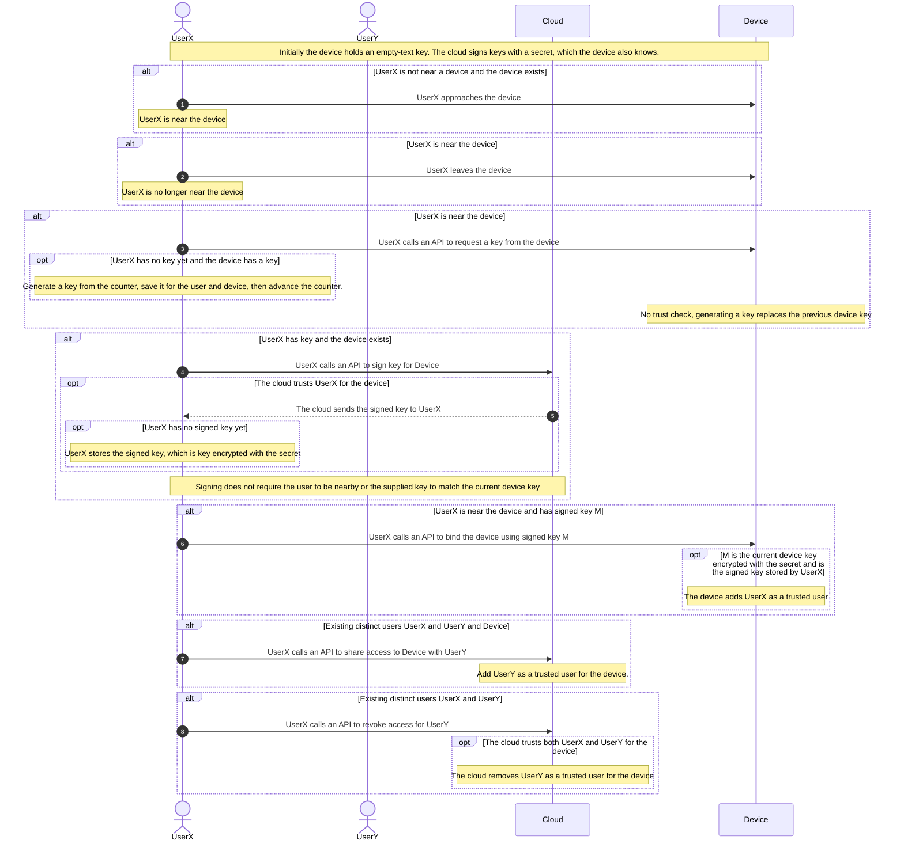

```mermaid
sequenceDiagram
    autonumber
    actor UserX
    actor UserY
    participant Cloud
    participant Device
    Note over UserX,Device: Initially the device holds an empty-text key. The cloud signs keys with a secret, which the device also knows.

    alt UserX is not near a device and the device exists
        UserX->>Device: UserX approaches the device
        Note over UserX: UserX is near the device
    end
    alt UserX is near the device
        UserX->>Device: UserX leaves the device
        Note over UserX: UserX is no longer near the device
    end

    alt UserX is near the device
        UserX->>Device: UserX calls an API to request a key from the device
        opt UserX has no key yet and the device has a key
            Note over UserX: Generate a key from the counter, save it for the user and device, then advance the counter.
        end
        Note over Device: No trust check, generating a key replaces the previous device key
    end

    alt UserX has key and the device exists
        UserX->>Cloud: UserX calls an API to sign key for Device
        opt The cloud trusts UserX for the device
            Cloud-->>UserX: The cloud sends the signed key to UserX
            opt UserX has no signed key yet
                Note over UserX: UserX stores the signed key, which is key encrypted with the secret
            end
        end
        Note over UserX,Cloud: Signing does not require the user to be nearby or the supplied key to match the current device key
    end

    alt UserX is near the device and has signed key M
        UserX->>Device: UserX calls an API to bind the device using signed key M
        opt M is the current device key encrypted with the secret and is the signed key stored by UserX
            Note over Device: The device adds UserX as a trusted user
        end
    end

    alt Existing distinct users UserX and UserY and Device
        UserX->>Cloud: UserX calls an API to share access to Device with UserY
        Note over Cloud: Add UserY as a trusted user for the device.
    end
    alt Existing distinct users UserX and UserY
        UserX->>Cloud: UserX calls an API to revoke access for UserY
        opt The cloud trusts both UserX and UserY for the device
            Note over Cloud: The cloud removes UserY as a trusted user for the device
        end
    end
```
