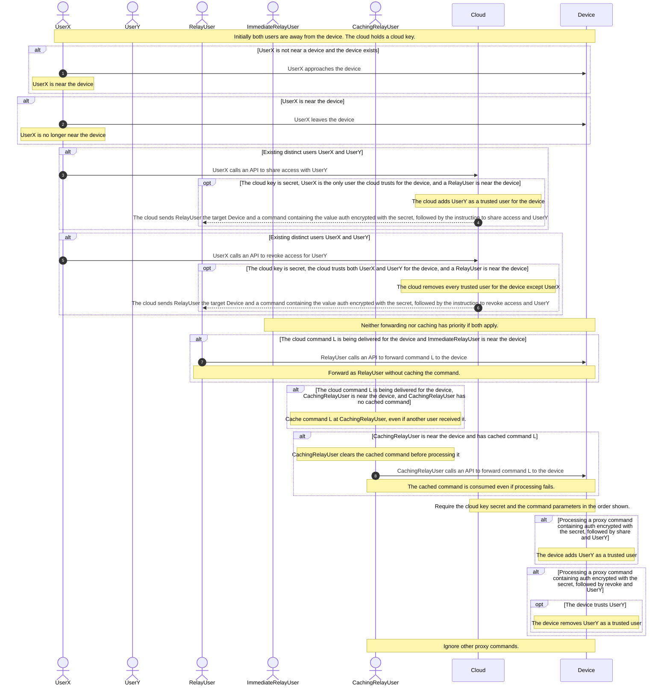

```mermaid
sequenceDiagram
    autonumber
    actor UserX
    actor UserY
    actor RelayUser
    actor ImmediateRelayUser
    actor CachingRelayUser
    participant Cloud
    participant Device
    Note over UserX,Device: Initially both users are away from the device. The cloud holds a cloud key.

    alt UserX is not near a device and the device exists
        UserX->>Device: UserX approaches the device
        Note over UserX: UserX is near the device
    end
    alt UserX is near the device
        UserX->>Device: UserX leaves the device
        Note over UserX: UserX is no longer near the device
    end

    alt Existing distinct users UserX and UserY
        UserX->>Cloud: UserX calls an API to share access with UserY
        opt The cloud key is secret, UserX is the only user the cloud trusts for the device, and a RelayUser is near the device
            Note over Cloud: The cloud adds UserY as a trusted user for the device
            Cloud-->>RelayUser: The cloud sends RelayUser the target Device and a command containing the value auth encrypted with the secret, followed by the instruction to share access and UserY
        end
    end
    alt Existing distinct users UserX and UserY
        UserX->>Cloud: UserX calls an API to revoke access for UserY
        opt The cloud key is secret, the cloud trusts both UserX and UserY for the device, and a RelayUser is near the device
            Note over Cloud: The cloud removes every trusted user for the device except UserX
            Cloud-->>RelayUser: The cloud sends RelayUser the target Device and a command containing the value auth encrypted with the secret, followed by the instruction to revoke access and UserY
        end
    end

    Note over ImmediateRelayUser,Device: Neither forwarding nor caching has priority if both apply.
    alt The cloud command L is being delivered for the device and ImmediateRelayUser is near the device
        RelayUser->>Device: RelayUser calls an API to forward command L to the device
        Note over RelayUser,Device: Forward as RelayUser without caching the command.
    end
    alt The cloud command L is being delivered for the device, CachingRelayUser is near the device, and CachingRelayUser has no cached command
        Note over CachingRelayUser: Cache command L at CachingRelayUser, even if another user received it.
    end

    alt CachingRelayUser is near the device and has cached command L
        Note over CachingRelayUser: CachingRelayUser clears the cached command before processing it
        CachingRelayUser->>Device: CachingRelayUser calls an API to forward command L to the device
        Note over CachingRelayUser,Device: The cached command is consumed even if processing fails.
    end
    Note over Cloud,Device: Require the cloud key secret and the command parameters in the order shown.
    alt Processing a proxy command containing auth encrypted with the secret, followed by share and UserY
        Note over Device: The device adds UserY as a trusted user
    end
    alt Processing a proxy command containing auth encrypted with the secret, followed by revoke and UserY
        opt The device trusts UserY
            Note over Device: The device removes UserY as a trusted user
        end
    end
    Note over CachingRelayUser,Device: Ignore other proxy commands.
```
