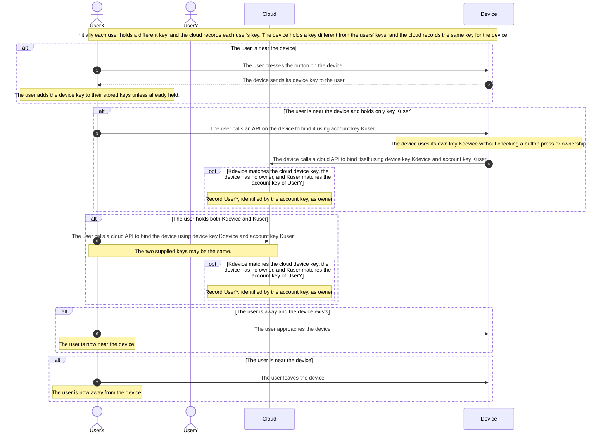

```mermaid
sequenceDiagram
    autonumber
    actor UserX
    actor UserY
    participant Cloud
    participant Device
    Note over UserX,Device: Initially each user holds a different key, and the cloud records each user's key. The device holds a key different from the users' keys, and the cloud records the same key for the device.
    alt The user is near the device
        UserX->>Device: The user presses the button on the device
        Device-->>UserX: The device sends its device key to the user
        Note over UserX: The user adds the device key to their stored keys unless already held.
    end
    alt The user is near the device and holds only key Kuser
        UserX->>Device: The user calls an API on the device to bind it using account key Kuser
        Note over Device: The device uses its own key Kdevice without checking a button press or ownership.
        Device->>Cloud: The device calls a cloud API to bind itself using device key Kdevice and account key Kuser
        opt Kdevice matches the cloud device key, the device has no owner, and Kuser matches the account key of UserY
            Note over Cloud: Record UserY, identified by the account key, as owner.
        end
    end
    alt The user holds both Kdevice and Kuser
        UserX->>Cloud: The user calls a cloud API to bind the device using device key Kdevice and account key Kuser
        Note over UserX,Cloud: The two supplied keys may be the same.
        opt Kdevice matches the cloud device key, the device has no owner, and Kuser matches the account key of UserY
            Note over Cloud: Record UserY, identified by the account key, as owner.
        end
    end
    alt The user is away and the device exists
        UserX->>Device: The user approaches the device
        Note over UserX: The user is now near the device.
    end
    alt The user is near the device
        UserX->>Device: The user leaves the device
        Note over UserX: The user is now away from the device.
    end
```
