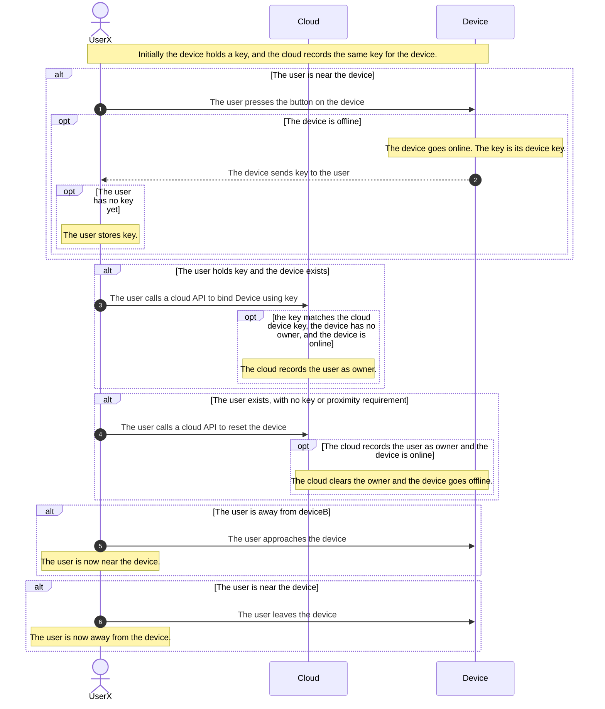

```mermaid
sequenceDiagram
    autonumber
    actor UserX
    participant Cloud
    participant Device
    Note over UserX,Device: Initially the device holds a key, and the cloud records the same key for the device.
    alt The user is near the device
        UserX->>Device: The user presses the button on the device
        opt The device is offline
            Note over Device: The device goes online. The key is its device key.
            Device-->>UserX: The device sends key to the user
            opt The user has no key yet
                Note over UserX: The user stores key.
            end
        end
    end
    alt The user holds key and the device exists
        UserX->>Cloud: The user calls a cloud API to bind Device using key
        opt the key matches the cloud device key, the device has no owner, and the device is online
            Note over Cloud: The cloud records the user as owner.
        end
    end
    alt The user exists, with no key or proximity requirement
        UserX->>Cloud: The user calls a cloud API to reset the device
        opt The cloud records the user as owner and the device is online
            Note over Cloud,Device: The cloud clears the owner and the device goes offline.
        end
    end
    alt The user is away from deviceB
        UserX->>Device: The user approaches the device
        Note over UserX: The user is now near the device.
    end
    alt The user is near the device
        UserX->>Device: The user leaves the device
        Note over UserX: The user is now away from the device.
    end
```
