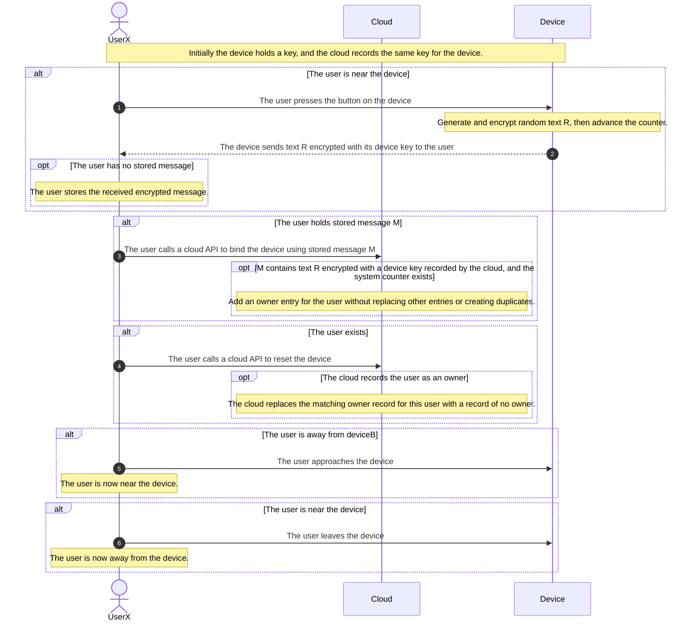

```mermaid
sequenceDiagram
    autonumber
    actor UserX
    participant Cloud
    participant Device
    Note over UserX,Device: Initially the device holds a key, and the cloud records the same key for the device.
    alt The user is near the device
        UserX->>Device: The user presses the button on the device
        Note over Device: Generate and encrypt random text R, then advance the counter.
        Device-->>UserX: The device sends text R encrypted with its device key to the user
        opt The user has no stored message
            Note over UserX: The user stores the received encrypted message.
        end
    end
    alt The user holds stored message M
        UserX->>Cloud: The user calls a cloud API to bind the device using stored message M
        opt M contains text R encrypted with a device key recorded by the cloud, and the system counter exists
            Note over Cloud: Add an owner entry for the user without replacing other entries or creating duplicates.
        end
    end
    alt The user exists
        UserX->>Cloud: The user calls a cloud API to reset the device
        opt The cloud records the user as an owner
            Note over Cloud: The cloud replaces the matching owner record for this user with a record of no owner.
        end
    end
    alt The user is away from deviceB
        UserX->>Device: The user approaches the device
        Note over UserX: The user is now near the device.
    end
    alt The user is near the device
        UserX->>Device: The user leaves the device
        Note over UserX: The user is now away from the device.
    end
```
