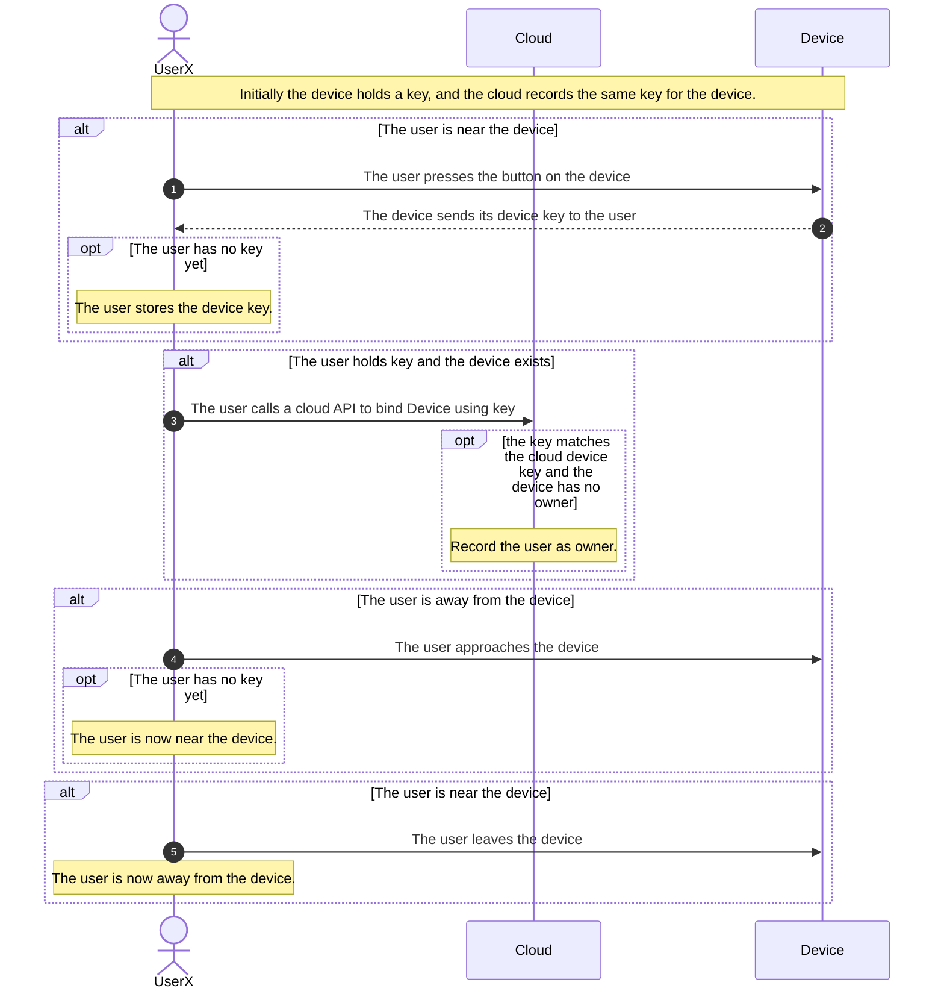

```mermaid
sequenceDiagram
    autonumber
    actor UserX
    participant Cloud
    participant Device
    Note over UserX,Device: Initially the device holds a key, and the cloud records the same key for the device.
    alt The user is near the device
        UserX->>Device: The user presses the button on the device
        Device-->>UserX: The device sends its device key to the user
        opt The user has no key yet
            Note over UserX: The user stores the device key.
        end
    end
    alt The user holds key and the device exists
        UserX->>Cloud: The user calls a cloud API to bind Device using key
        opt the key matches the cloud device key and the device has no owner
            Note over Cloud: Record the user as owner.
        end
    end
    alt The user is away from the device
        UserX->>Device: The user approaches the device
        opt The user has no key yet
            Note over UserX: The user is now near the device.
        end
    end
    alt The user is near the device
        UserX->>Device: The user leaves the device
        Note over UserX: The user is now away from the device.
    end
```
