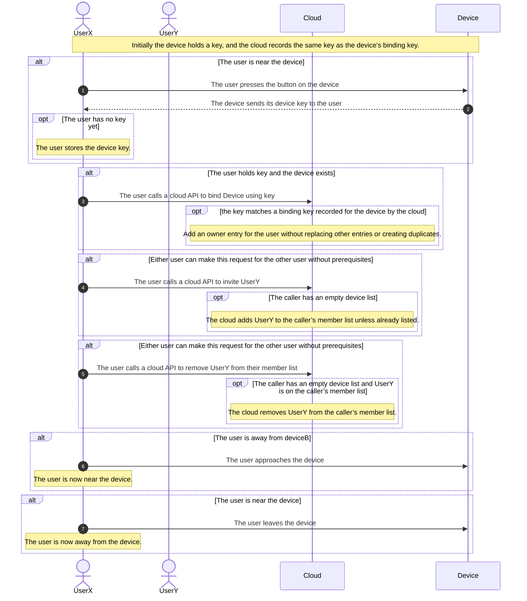

```mermaid
sequenceDiagram
    autonumber
    actor UserX
    actor UserY
    participant Cloud
    participant Device
    Note over UserX,Device: Initially the device holds a key, and the cloud records the same key as the device's binding key.
    alt The user is near the device
        UserX->>Device: The user presses the button on the device
        Device-->>UserX: The device sends its device key to the user
        opt The user has no key yet
            Note over UserX: The user stores the device key.
        end
    end
    alt The user holds key and the device exists
        UserX->>Cloud: The user calls a cloud API to bind Device using key
        opt the key matches a binding key recorded for the device by the cloud
            Note over Cloud: Add an owner entry for the user without replacing other entries or creating duplicates.
        end
    end
    alt Either user can make this request for the other user without prerequisites
        UserX->>Cloud: The user calls a cloud API to invite UserY
        opt The caller has an empty device list
            Note over Cloud: The cloud adds UserY to the caller’s member list unless already listed.
        end
    end
    alt Either user can make this request for the other user without prerequisites
        UserX->>Cloud: The user calls a cloud API to remove UserY from their member list
        opt The caller has an empty device list and UserY is on the caller’s member list
            Note over Cloud: The cloud removes UserY from the caller’s member list.
        end
    end
    alt The user is away from deviceB
        UserX->>Device: The user approaches the device
        Note over UserX: The user is now near the device.
    end
    alt The user is near the device
        UserX->>Device: The user leaves the device
        Note over UserX: The user is now away from the device.
    end
```
