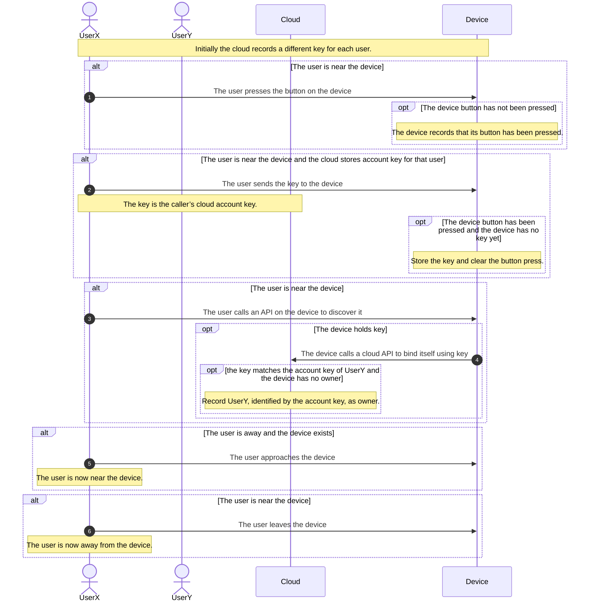

```mermaid
sequenceDiagram
    autonumber
    actor UserX
    actor UserY
    participant Cloud
    participant Device
    Note over UserX,Device: Initially the cloud records a different key for each user.
    alt The user is near the device
        UserX->>Device: The user presses the button on the device
        opt The device button has not been pressed
            Note over Device: The device records that its button has been pressed.
        end
    end
    alt The user is near the device and the cloud stores account key for that user
        UserX->>Device: The user sends the key to the device
        Note over UserX,Cloud: The key is the caller’s cloud account key.
        opt The device button has been pressed and the device has no key yet
            Note over Device: Store the key and clear the button press.
        end
    end
    alt The user is near the device
        UserX->>Device: The user calls an API on the device to discover it
        opt The device holds key
            Device->>Cloud: The device calls a cloud API to bind itself using key
            opt the key matches the account key of UserY and the device has no owner
                Note over Cloud: Record UserY, identified by the account key, as owner.
            end
        end
    end
    alt The user is away and the device exists
        UserX->>Device: The user approaches the device
        Note over UserX: The user is now near the device.
    end
    alt The user is near the device
        UserX->>Device: The user leaves the device
        Note over UserX: The user is now away from the device.
    end
```
