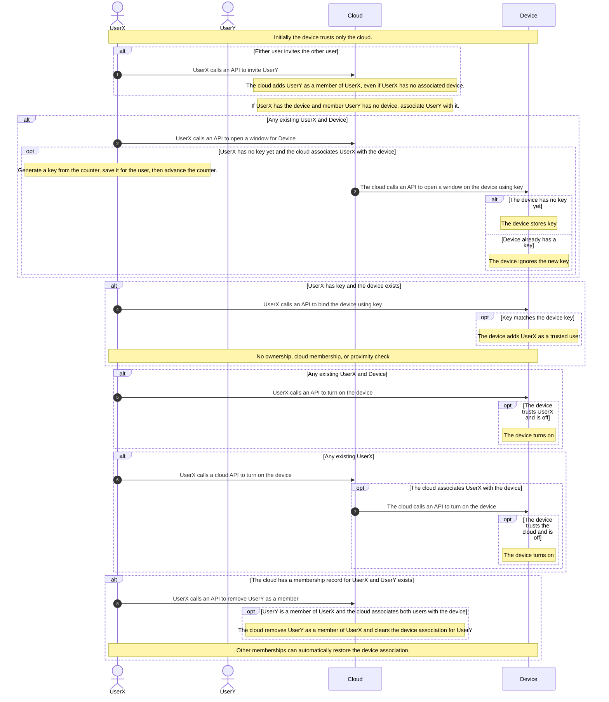

```mermaid
sequenceDiagram
    autonumber
    actor UserX
    actor UserY
    participant Cloud
    participant Device
    Note over UserX,Device: Initially the device trusts only the cloud.

    alt Either user invites the other user
        UserX->>Cloud: UserX calls an API to invite UserY
        Note over Cloud: The cloud adds UserY as a member of UserX, even if UserX has no associated device.
    end
    Note over Cloud: If UserX has the device and member UserY has no device, associate UserY with it.

    alt Any existing UserX and Device
        UserX->>Cloud: UserX calls an API to open a window for Device
        opt UserX has no key yet and the cloud associates UserX with the device
            Note over UserX: Generate a key from the counter, save it for the user, then advance the counter.
            Cloud->>Device: The cloud calls an API to open a window on the device using key
            alt The device has no key yet
                Note over Device: The device stores key
            else Device already has a key
                Note over Device: The device ignores the new key
            end
        end
    end

    alt UserX has key and the device exists
        UserX->>Device: UserX calls an API to bind the device using key
        opt Key matches the device key
            Note over Device: The device adds UserX as a trusted user
        end
        Note over UserX,Device: No ownership, cloud membership, or proximity check
    end

    alt Any existing UserX and Device
        UserX->>Device: UserX calls an API to turn on the device
        opt The device trusts UserX and is off
            Note over Device: The device turns on
        end
    end

    alt Any existing UserX
        UserX->>Cloud: UserX calls a cloud API to turn on the device
        opt The cloud associates UserX with the device
            Cloud->>Device: The cloud calls an API to turn on the device
            opt The device trusts the cloud and is off
                Note over Device: The device turns on
            end
        end
    end

    alt The cloud has a membership record for UserX and UserY exists
        UserX->>Cloud: UserX calls an API to remove UserY as a member
        opt UserY is a member of UserX and the cloud associates both users with the device
            Note over Cloud: The cloud removes UserY as a member of UserX and clears the device association for UserY
        end
        Note over UserX,Device: Other memberships can automatically restore the device association.
    end
```
