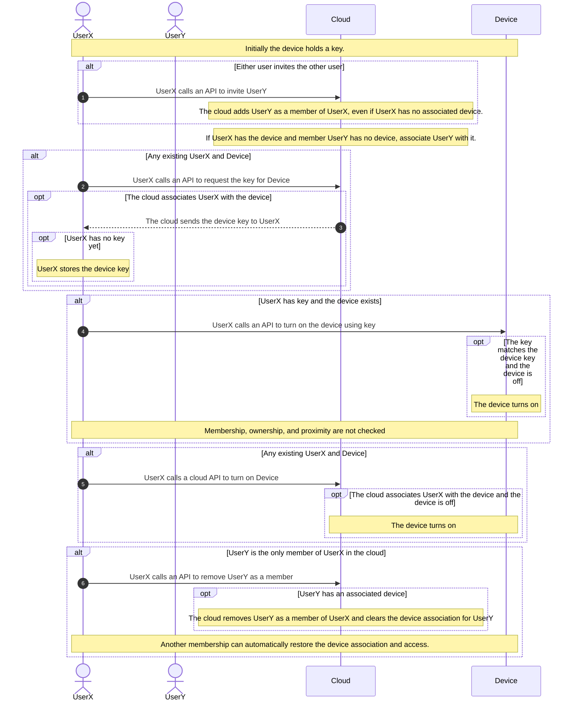

```mermaid
sequenceDiagram
    autonumber
    actor UserX
    actor UserY
    participant Cloud
    participant Device
    Note over UserX,Device: Initially the device holds a key.

    alt Either user invites the other user
        UserX->>Cloud: UserX calls an API to invite UserY
        Note over Cloud: The cloud adds UserY as a member of UserX, even if UserX has no associated device.
    end
    Note over Cloud: If UserX has the device and member UserY has no device, associate UserY with it.

    alt Any existing UserX and Device
        UserX->>Cloud: UserX calls an API to request the key for Device
        opt The cloud associates UserX with the device
            Cloud-->>UserX: The cloud sends the device key to UserX
            opt UserX has no key yet
                Note over UserX: UserX stores the device key
            end
        end
    end

    alt UserX has key and the device exists
        UserX->>Device: UserX calls an API to turn on the device using key
        opt The key matches the device key and the device is off
            Note over Device: The device turns on
        end
        Note over UserX,Device: Membership, ownership, and proximity are not checked
    end

    alt Any existing UserX and Device
        UserX->>Cloud: UserX calls a cloud API to turn on Device
        opt The cloud associates UserX with the device and the device is off
            Note over Cloud,Device: The device turns on
        end
    end

    alt UserY is the only member of UserX in the cloud
        UserX->>Cloud: UserX calls an API to remove UserY as a member
        opt UserY has an associated device
            Note over Cloud: The cloud removes UserY as a member of UserX and clears the device association for UserY
        end
        Note over UserX,Device: Another membership can automatically restore the device association and access.
    end
```
