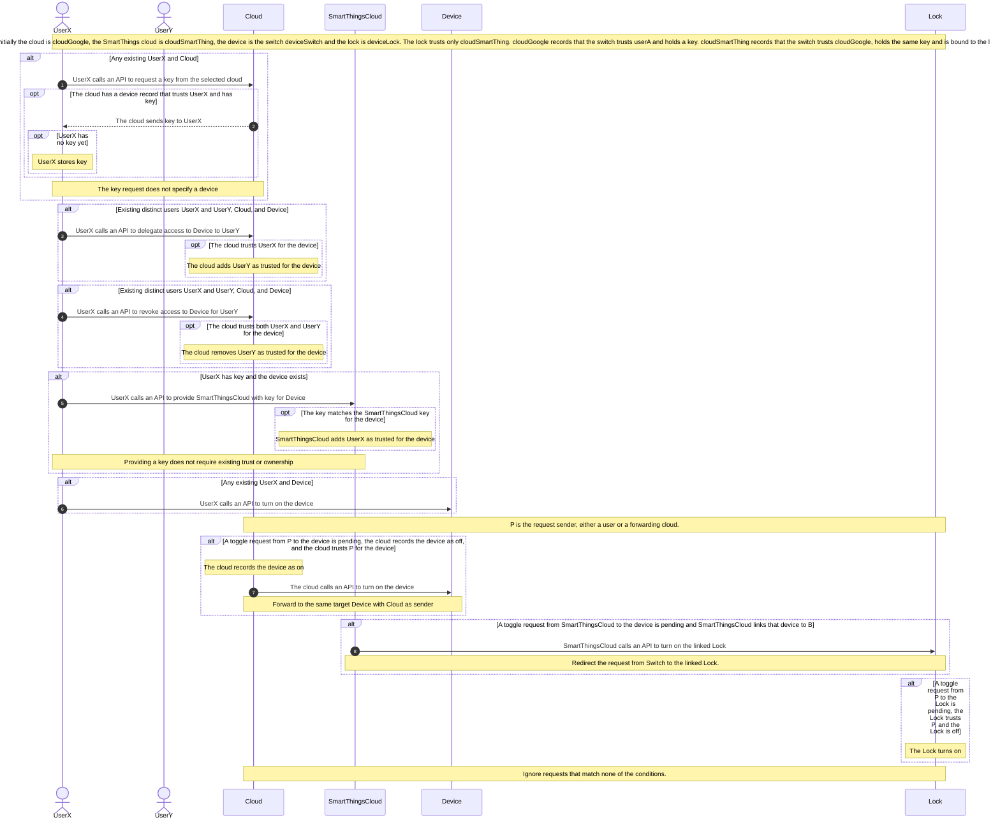

```mermaid
sequenceDiagram
    autonumber
    actor UserX
    actor UserY
    participant Cloud
    participant SmartThingsCloud
    participant Device
    participant Lock
    Note over UserX,Lock: Initially the cloud is cloudGoogle, the SmartThings cloud is cloudSmartThing, the device is the switch deviceSwitch and the lock is deviceLock. The lock trusts only cloudSmartThing. cloudGoogle records that the switch trusts userA and holds a key. cloudSmartThing records that the switch trusts cloudGoogle, holds the same key and is bound to the lock.

    alt Any existing UserX and Cloud
        UserX->>Cloud: UserX calls an API to request a key from the selected cloud
        opt The cloud has a device record that trusts UserX and has key
            Cloud-->>UserX: The cloud sends key to UserX
            opt UserX has no key yet
                Note over UserX: UserX stores key
            end
        end
        Note over UserX,Cloud: The key request does not specify a device
    end

    alt Existing distinct users UserX and UserY, Cloud, and Device
        UserX->>Cloud: UserX calls an API to delegate access to Device to UserY
        opt The cloud trusts UserX for the device
            Note over Cloud: The cloud adds UserY as trusted for the device
        end
    end
    alt Existing distinct users UserX and UserY, Cloud, and Device
        UserX->>Cloud: UserX calls an API to revoke access to Device for UserY
        opt The cloud trusts both UserX and UserY for the device
            Note over Cloud: The cloud removes UserY as trusted for the device
        end
    end

    alt UserX has key and the device exists
        UserX->>SmartThingsCloud: UserX calls an API to provide SmartThingsCloud with key for Device
        opt The key matches the SmartThingsCloud key for the device
            Note over SmartThingsCloud: SmartThingsCloud adds UserX as trusted for the device
        end
        Note over UserX,SmartThingsCloud: Providing a key does not require existing trust or ownership
    end

    alt Any existing UserX and Device
        UserX->>Device: UserX calls an API to turn on the device
    end

    Note over Cloud,Lock: P is the request sender, either a user or a forwarding cloud.
    alt A toggle request from P to the device is pending, the cloud records the device as off, and the cloud trusts P for the device
        Note over Cloud: The cloud records the device as on
        Cloud->>Device: The cloud calls an API to turn on the device
        Note over Cloud,Device: Forward to the same target Device with Cloud as sender
    end
    alt A toggle request from SmartThingsCloud to the device is pending and SmartThingsCloud links that device to B
        SmartThingsCloud->>Lock: SmartThingsCloud calls an API to turn on the linked Lock
        Note over SmartThingsCloud,Lock: Redirect the request from Switch to the linked Lock.
    end
    alt A toggle request from P to the Lock is pending, the Lock trusts P, and the Lock is off
        Note over Lock: The Lock turns on
    end
    Note over Cloud,Lock: Ignore requests that match none of the conditions.
```
