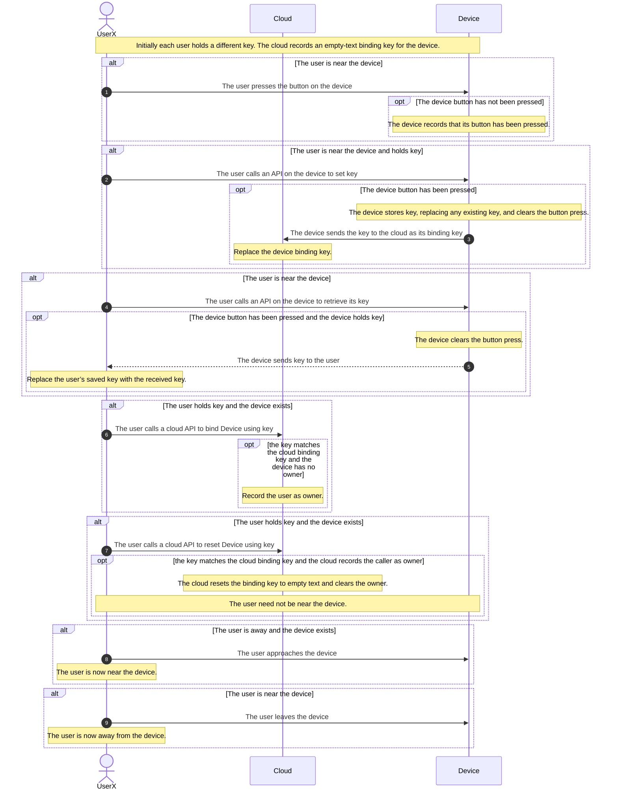

```mermaid
sequenceDiagram
    autonumber
    actor UserX
    participant Cloud
    participant Device
    Note over UserX,Device: Initially each user holds a different key. The cloud records an empty-text binding key for the device.
    alt The user is near the device
        UserX->>Device: The user presses the button on the device
        opt The device button has not been pressed
            Note over Device: The device records that its button has been pressed.
        end
    end
    alt The user is near the device and holds key
        UserX->>Device: The user calls an API on the device to set key
        opt The device button has been pressed
            Note over Device: The device stores key, replacing any existing key, and clears the button press.
            Device->>Cloud: The device sends the key to the cloud as its binding key
            Note over Cloud: Replace the device binding key.
        end
    end
    alt The user is near the device
        UserX->>Device: The user calls an API on the device to retrieve its key
        opt The device button has been pressed and the device holds key
            Note over Device: The device clears the button press.
            Device-->>UserX: The device sends key to the user
            Note over UserX: Replace the user’s saved key with the received key.
        end
    end
    alt The user holds key and the device exists
        UserX->>Cloud: The user calls a cloud API to bind Device using key
        opt the key matches the cloud binding key and the device has no owner
            Note over Cloud: Record the user as owner.
        end
    end
    alt The user holds key and the device exists
        UserX->>Cloud: The user calls a cloud API to reset Device using key
        opt the key matches the cloud binding key and the cloud records the caller as owner
            Note over Cloud: The cloud resets the binding key to empty text and clears the owner.
            Note over UserX,Device: The user need not be near the device.
        end
    end
    alt The user is away and the device exists
        UserX->>Device: The user approaches the device
        Note over UserX: The user is now near the device.
    end
    alt The user is near the device
        UserX->>Device: The user leaves the device
        Note over UserX: The user is now away from the device.
    end
```
