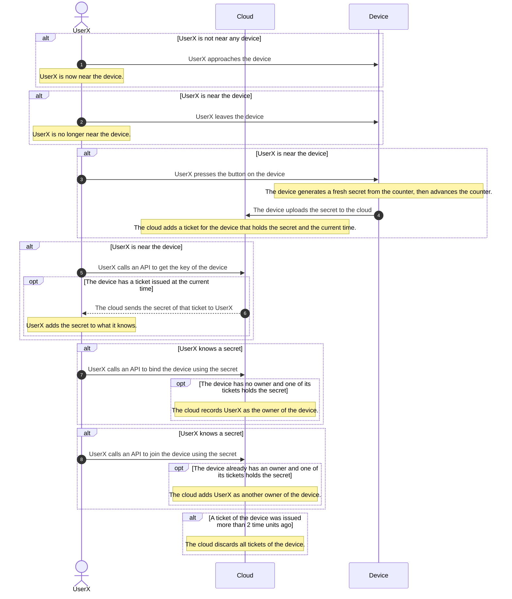

```mermaid
sequenceDiagram
    autonumber
    actor UserX
    participant Cloud
    participant Device

    alt UserX is not near any device
        UserX->>Device: UserX approaches the device
        Note over UserX: UserX is now near the device.
    end
    alt UserX is near the device
        UserX->>Device: UserX leaves the device
        Note over UserX: UserX is no longer near the device.
    end

    alt UserX is near the device
        UserX->>Device: UserX presses the button on the device
        Note over Device: The device generates a fresh secret from the counter, then advances the counter.
        Device->>Cloud: The device uploads the secret to the cloud
        Note over Cloud: The cloud adds a ticket for the device that holds the secret and the current time.
    end

    alt UserX is near the device
        UserX->>Cloud: UserX calls an API to get the key of the device
        opt The device has a ticket issued at the current time
            Cloud-->>UserX: The cloud sends the secret of that ticket to UserX
            Note over UserX: UserX adds the secret to what it knows.
        end
    end

    alt UserX knows a secret
        UserX->>Cloud: UserX calls an API to bind the device using the secret
        opt The device has no owner and one of its tickets holds the secret
            Note over Cloud: The cloud records UserX as the owner of the device.
        end
    end

    alt UserX knows a secret
        UserX->>Cloud: UserX calls an API to join the device using the secret
        opt The device already has an owner and one of its tickets holds the secret
            Note over Cloud: The cloud adds UserX as another owner of the device.
        end
    end

    alt A ticket of the device was issued more than 2 time units ago
        Note over Cloud: The cloud discards all tickets of the device.
    end
```
